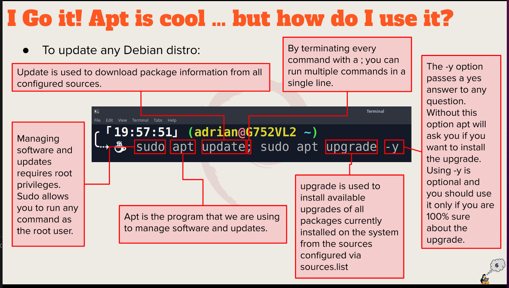
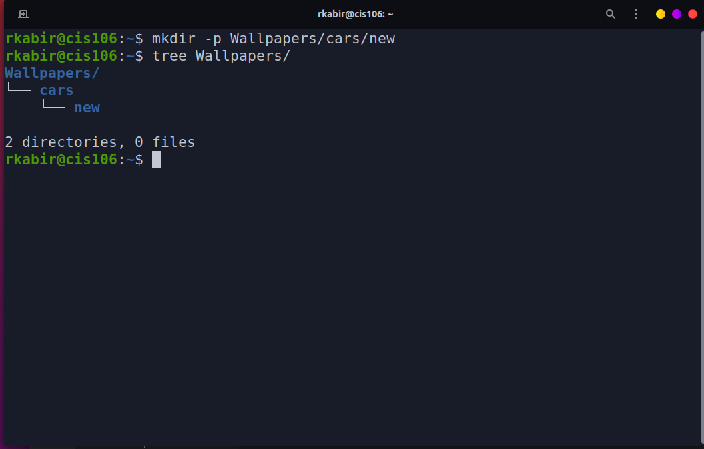

## What is Virtualization?

Replication of hardware to simulate a virtual machine inside a physical machine.

### Types of virtualization
* **Client side virtualization:**
*  Software installed on a computer to manage virtual maachines.
*  Each VM has its own operating system installed.
* **Server side virtualization:** there are 3 types of virtual desktop infrastructure (VDI) 
* Thick clint or fat client
* Thin client
* Zero client

### Hypervisor
A hypervisor is software that creates and runs virtual machines (VMs). A hypervisor, sometimes called a virtual machine monitor (VMM), isolates the hypervisor operating system and resources from the virtual machines and enables the creation and management of those VMs.

### Types of Hypervisor
* **Type 1:** Runs on hardware
  Example are:
   VMware ESX and ESXi
   Citrix XenServer
* **Type 2:** Runs on a Host Operating system
  Example are:
   VMware Workstation Player/Pro
   Oracle VirtualBox

## Virtualbox
<br>

VirtualBox is a powerful type 2 virtualization product for enterprise as well as home use. it is a open source under the GPL version 2. And it runs on windows, linux, macintosh, and solaris. It also supports a large number of guest operating systems.

### How to install virtualbox in windows 10 Download installer from [virtualbox.org](https://www.virtualbox.org/)

2) Start the Installation
3) Select the amount of RAM
4) Create a virtual hard drive 
5) Select your ISO as the startup disk
6) Finish installing on windows 10
7) Turn on the startup menu

### How to create a virtual machine
<br>

**Step 1:** Once you have VirtualBox running, click the "New" button
**Step 2:** Next you will have to choose which OS you plan on installing
**Step 3:** In the "Name" box, type the name of the OS you want to install. VirtualBox will guess the type and version based on the name you type in, but you can change these settings if you need to.
**step 4:** The wizard will automatically select default settings based on the OS type and version you selected. You can always change the settings as you go through the wizard. Just keep clicking "Continue" and "Create" until you get through the wizard. It's usually fine to use the defaults.
**Step 5:** Next, start the virtual machine you just created by clicking "Start".

## Installing Ubuntu in virtualbox
<br>

1) Open Virtualbox and click at New button.
2) Setup Wizard will appear and click at Next button.
3) Enter your Virtual Machine name, and choose your guest OS and architecture (32- vs. 64-bit) from the dropdown menu and click Next button.
4) Enter memory (RAM) to reserve for your virtual machine and click Next button. 
5) Tick at Startup Disk and Create New Hard disk and click at Next button.
6) Choose the type of file that you want to use for virtual disk and click Next button.
7) Choose your storage detail and click Next button.
8) Enter the size of your virtual disk (in MB) and click Next button.
9) You will see the detail of your input here. Click Create button to continue.
10) The "New Virtual Machine Wizard" will close and back to VirtualBox Manager. Select your Virtual Machine and click Start button.
11) Click at 'folder' icon and choose your Ubuntu iso directory.
12) Select your Ubuntu iso file and click Next button.
13) In 'Summary' box, click Start button.
14) After a successful installation we have to remove our installation .iso image from the virtual optical drive before we reboot. This can be done from the "Devices" menu or by removing the .iso from the VM settings.

### Updating Ubuntu 
<br>

In the terminal, you just have to use the command on the picture. It will ask for your account password. After the password, this will update the packages in ubuntu.

### Installing Software in Ubuntu
* Installation command examples
* searching for software
* Deleting software
  * `sudo apt remove + package name`
    * Example:
      * `sudo apt remove vlc` will remove VLC package.


## Basic linux commands 

### Navigating the filesystem
#### pwd 
* Description: usen for displaying the current working directory
#### cd
* Description: usen for changing the working directory. When no directory is given, cd changes the current working directory to the home directory of the user.
Usage: `cd + destination`
* Example:
  * If you want to go to your home directory you can use
 ```
    * cd
    * cd ~
    * cd $HOME
 ```
  * If you want to go to the previous current working directory you can use
    * `cd -`


### managing files and directories
#### Mkdir
* Description: used for creating directory.
* Usage: `mkdir + option + new directory path`
* Example:
  * Create a directory in the present working directory
      * `mkdir wallpaper/`
  * Create a parent directory and child directory
    * `mkdir Wallpaper/cars/new`
  <br> 
