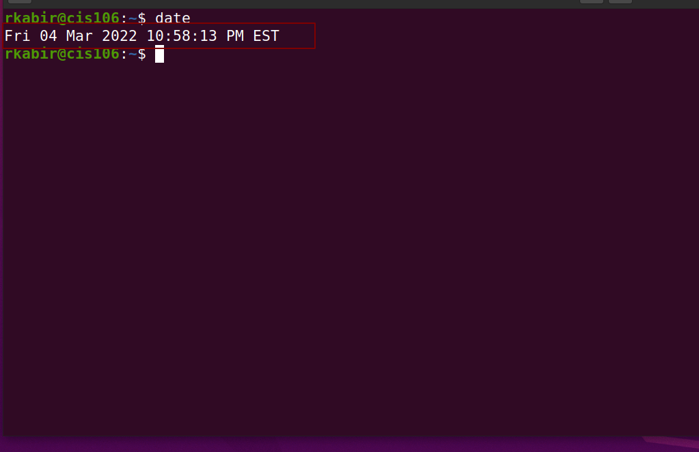
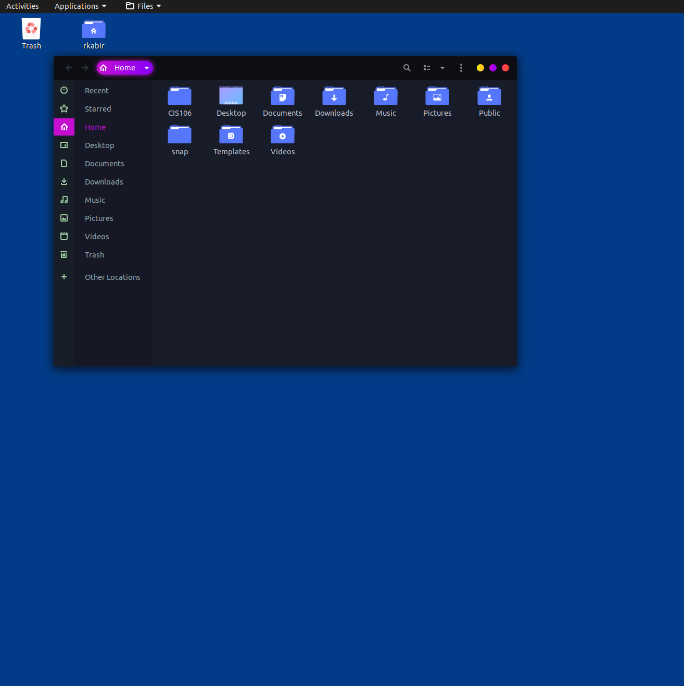
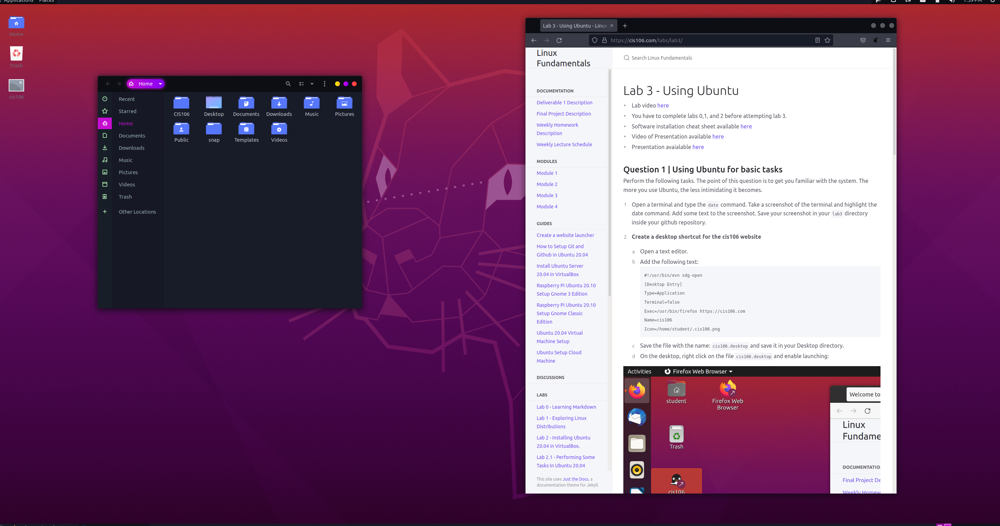

# Lab 3 using Ubuntu

# Question 1
 

# Question 2

# Question 3
| Program Purpose     | Package      | Version       | Description                                        |
|---------------------|--------------|---------------|----------------------------------------------------|
| Play a tetris game  | quadrapassel | 1:3.36.0-1    | popular Russian game, similar to Tetris |
| Play a video file   | zoneminder   | 1.32.3-2      |  video camera security and surveillance solution          |
| Browse the internet | zmap         | 2:1.0.5+ds1-3 |  network scanner for researchers           |
| Read your email     | zim          | 0.72.0-1      |  graphical text editor based on wiki technologies           |
| Play music          | zomg         | 0.8.1-2       | console-based libre.fm submission and radio client            |

commands answers: 
* Sub question 1: 'sudo apt install firefox flameshot caffine -y'
* Sub question 2: 'sudo apt remove firefox flameshot caffine -y
* sub question 3: 'sudo apt install firefox+ flameshot+ caffeine- vlc+
* 
  # Question 4
| command | what it does |
|---------|--------------|
| echo    |  display a line of text            |
| fortune | print a random, hopefully interesting, adage             |
| cowsay  |  configurable speaking/thinking cow (and a bit more)            |
| lolcat  |  rainbow coloring for text             |
| figlet  |  display large characters made up of ordinary screen characters |
| toilet  |  display large colourful characters |
| rig     | Random Identity Generator
